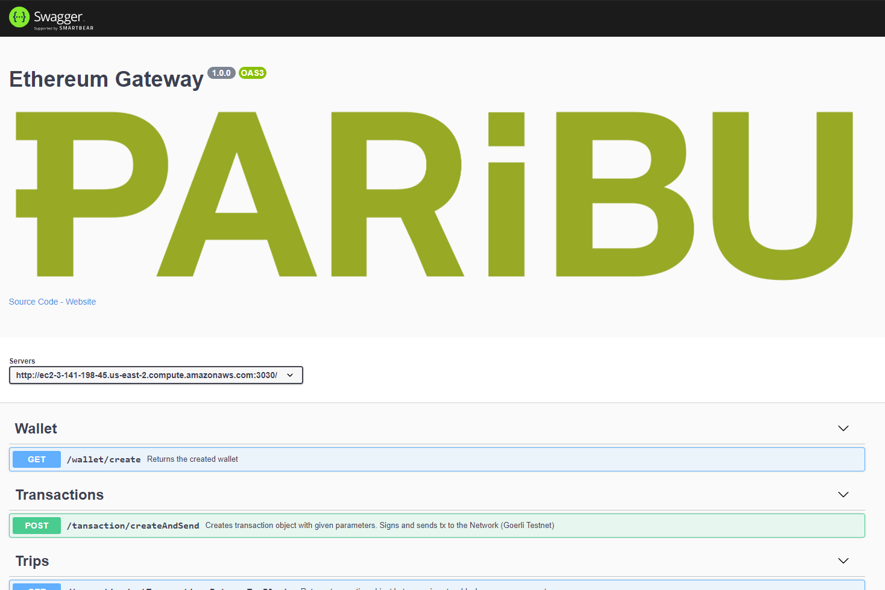
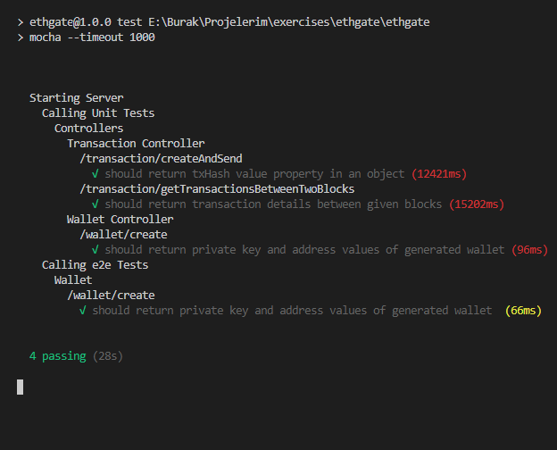

# Etheretum Gateway

An ethereum gateway service application for fetching transactions, creating ethereum wallets, creating and broadcasting ethereum blockchain transactions on Goerli Testnet.
<br>

# Installation

- Clone repository or download it manually
  
  ```bash
  git clone https://github.com/xbersoy/ethgate
  ```
  
- Install dependencies

  ```bash
  npm install
  ```

- Start the application
  
  ```bash
  npm start
  ```
  or with nodemon
  ```bash
  npm run watch
  ```
  That's all! Application should be running on localhost:3005. <br><br>
  To run tests
  ```bash
  npm test
  ```

## Install with docker

```bash
docker container run 
  -p <desired_port>:3005 burakersoy/ethgatev1 
```
<br>

# Swagger
You can test see and test all endpoints with swagger ui. <br>
http://ec2-3-141-198-45.us-east-2.compute.amazonaws.com:3030/api-docs

<br><br>

# AWS
Application has been deployed to aws and the container runs on a ec2 instance. You can use the link below.
http://ec2-3-141-198-45.us-east-2.compute.amazonaws.com:3030/

<br>

# Test Result

<br>
More tests can be added<br>
<br>

# Endpoints

### GET /wallet/create

Returns private key and public address of generated wallet.
<br><br>

<br>

Sample Response <br>

Success

```bash
{
    "success": true,
    "data": {
        "privateKey": "0xecf508229eb793cb1591572bbc8836d4aa96040c9373a66d144265c229859880",
        "address": "0x0d338D4006F70BE9C9fD8a2466C115945a0F402F"
    }
}
```

### POST /transaction/createAndSend

This endpoint creates transaction object with given parameters. Signs and sends tx to the Network (Goerli Testnet)
<br><br>
Request Body

```bash
{
    "senderKey": "0xf0612c2b8950ecbf5bb34661dab5c2579c974fdf62422d0a045dc5a19b58c371",
    "address": "0x9D9dcE4cb5B796Dc6E3d00457D276Abe81c8491c",
    "amount": 2
}
```

<br>

Sample Response <br>

Success

```bash
{
    "success": true,
    "data": {
        "txHash": "0xf132a9bf86631e692c17b1c2d0dee65631eae8238a3d9b247b01f4cbd5787d1c"
    }
}
```

### GET /transaction/getTransactionsBetweenTwoBlocks

Returns transaction objects between given blocks.
<br><br>

Sample Query Parameters (/transaction/getTransactionsBetweenTwoBlocks?startBlock=4613300&endBlock=4613333)

startBlock=4613300 (required)
endBlock=4613333 (optional)

/transaction/getTransactionsBetweenTwoBlocks?startBlock=4613300&endBlock=4613333

<br>

Sample Response <br>

Success

```bash
{
    "success": true,
    "data": [
        {
            "from": "0x1D4c8636dF248D2c585a56e948E4fF805aC227c5",
            "to": "0x9202584Ac2A5081C6d1F27d637d1DD1Fb2AEc6B7",
            "amount": "0.298223694011240155",
            "token": "ETH",
            "timestamp": 1618337461,
            "blockNumber": 4613300
        },
        {
            "from": "0x7b5956CA58fF0941eFbf89dFE0B56ED8576Cd332",
            "to": "0x9202584Ac2A5081C6d1F27d637d1DD1Fb2AEc6B7",
            "amount": "0.297679132164570337",
            "token": "ETH",
            "timestamp": 1618337461,
            "blockNumber": 4613300
        }]
}
```